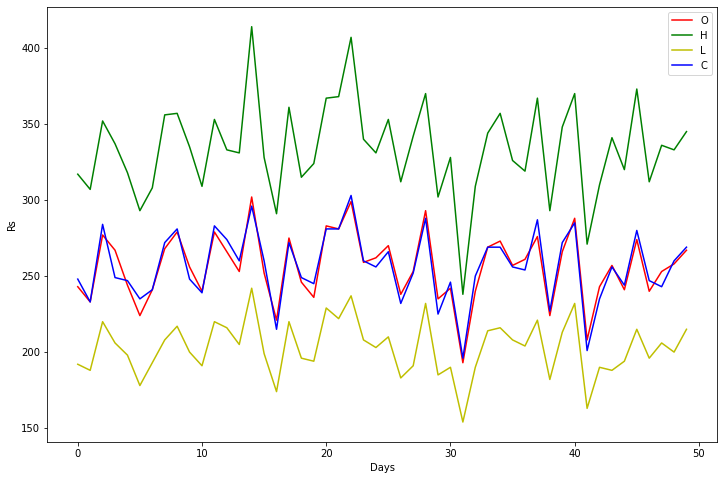

# EPAi3 Session 9

## Assignment

This assignment asks to implement these things:

1 - Use the Faker (Links to an external site.)library to get 10000 random profiles. Using namedtuple, calculate the largest blood type, mean-current_location, oldest_person_age, and average age (add proper doc-strings). - 250 (including 5 test cases).  
<br>
2 - Do the same thing above using a dictionary. Prove that namedtuple is faster. - 250 (including 5 test cases)
<br>
3 - Create fake data (you can use Faker for company names) for imaginary stock exchange for top 100 companies (name, symbol, open, high, close). Assign a random weight to all the companies. Calculate and show what value the stock market started at, what was the highest value during the day, and where did it end. Make sure your open, high, close are not totally random. You can only use namedtuple. - 500  (including 10 test cases). 
<br>
Add the notebook as well to your github where logs can be visible. 

===============IMPLEMENTATION BELOW========================

Import the implemented modules and test


```python
from session_7_named_tuples import nt_approach, dict_approach
```


```python
help(nt_approach)
```

    Help on function nt_approach in module session_7_named_tuples:
    
    nt_approach(num_profiles:int)
        function generates a profile of a person using faker library and
        using namedtuple, calculates the largest blood type, mean_location,
        oldest_person_age and average age using the namedtuple.
        returns namedtuple of the above data.
    


```python
print("----RESULTS for 'namedtuples'----")
nt_approach(10000)
```

    ----RESULTS for 'namedtuples'----

    (Stat(oldest_person=116, highest_blood='A-', mean_location=(0.9266254033, 0.0695691874), average_age=57.8549),
     'Average Time to Run the Function is: 18.084')


```python
print("----RESULTS for 'dictionary'----")
dict_approach(10000)
```

    ----RESULTS for 'dictionary'----

    ({'oldest_person': 116,
      'highest_blood': 'A-',
      'mean_location': (0.050042572, -0.5589975084),
      'average_age': 57.7113},
     'Average Time to Run the Function is: 16.902')


```python

```

## STOCK INDEX

Implement a stock exchange and emulate the stock data


```python
import pandas as pd
import matplotlib.pyplot as plt
```


```python
from session_7_named_tuples import tsai_index, stock
```


```python
df = pd.DataFrame(stock(100)[0], columns= ['Index', 'Name', 'Open', 'High', 'Low', "Close", "Contribution to Index"])

```


```python
df.head(15)

```


<div>
<style scoped>
    .dataframe tbody tr th:only-of-type {
        vertical-align: middle;
    }

    .dataframe tbody tr th {
        vertical-align: top;
    }

    .dataframe thead th {
        text-align: right;
    }
</style>
<table border="1" class="dataframe">
  <thead>
    <tr style="text-align: right;">
      <th></th>
      <th>Index</th>
      <th>Name</th>
      <th>Open</th>
      <th>High</th>
      <th>Low</th>
      <th>Close</th>
      <th>Contribution to Index</th>
    </tr>
  </thead>
  <tbody>
    <tr>
      <th>0</th>
      <td>BURLL</td>
      <td>Burgess LLC</td>
      <td>803</td>
      <td>1258</td>
      <td>625</td>
      <td>684</td>
      <td>0.010249</td>
    </tr>
    <tr>
      <th>1</th>
      <td>SAMGR</td>
      <td>Sampson Group</td>
      <td>481</td>
      <td>703</td>
      <td>343</td>
      <td>478</td>
      <td>0.005786</td>
    </tr>
    <tr>
      <th>2</th>
      <td>KIRIN</td>
      <td>Kirby Inc</td>
      <td>828</td>
      <td>1132</td>
      <td>706</td>
      <td>761</td>
      <td>0.013544</td>
    </tr>
    <tr>
      <th>3</th>
      <td>SCHSP</td>
      <td>Schwartz, Spencer and Ramirez</td>
      <td>743</td>
      <td>1118</td>
      <td>475</td>
      <td>628</td>
      <td>0.009359</td>
    </tr>
    <tr>
      <th>4</th>
      <td>KENIN</td>
      <td>Kennedy Inc</td>
      <td>864</td>
      <td>1207</td>
      <td>811</td>
      <td>811</td>
      <td>0.006074</td>
    </tr>
    <tr>
      <th>5</th>
      <td>TORRO</td>
      <td>Torres, Rogers and Schultz</td>
      <td>835</td>
      <td>915</td>
      <td>592</td>
      <td>733</td>
      <td>0.007479</td>
    </tr>
    <tr>
      <th>6</th>
      <td>YOUHO</td>
      <td>Young, Howell and Knapp</td>
      <td>373</td>
      <td>545</td>
      <td>286</td>
      <td>337</td>
      <td>0.014324</td>
    </tr>
    <tr>
      <th>7</th>
      <td>BROLL</td>
      <td>Brown LLC</td>
      <td>190</td>
      <td>233</td>
      <td>116</td>
      <td>179</td>
      <td>0.012214</td>
    </tr>
    <tr>
      <th>8</th>
      <td>HUNGR</td>
      <td>Hunt-Gregory</td>
      <td>107</td>
      <td>128</td>
      <td>87</td>
      <td>110</td>
      <td>0.008337</td>
    </tr>
    <tr>
      <th>9</th>
      <td>FOXWO</td>
      <td>Fox-Wolf</td>
      <td>881</td>
      <td>954</td>
      <td>602</td>
      <td>776</td>
      <td>0.007696</td>
    </tr>
    <tr>
      <th>10</th>
      <td>FARPL</td>
      <td>Farrell PLC</td>
      <td>494</td>
      <td>684</td>
      <td>478</td>
      <td>532</td>
      <td>0.013806</td>
    </tr>
    <tr>
      <th>11</th>
      <td>WALLT</td>
      <td>Walker Ltd</td>
      <td>165</td>
      <td>192</td>
      <td>104</td>
      <td>138</td>
      <td>0.010813</td>
    </tr>
    <tr>
      <th>12</th>
      <td>KIMDA</td>
      <td>Kim-Daniels</td>
      <td>514</td>
      <td>747</td>
      <td>477</td>
      <td>615</td>
      <td>0.006555</td>
    </tr>
    <tr>
      <th>13</th>
      <td>NEWYO</td>
      <td>Newman-Young</td>
      <td>810</td>
      <td>997</td>
      <td>647</td>
      <td>889</td>
      <td>0.008882</td>
    </tr>
    <tr>
      <th>14</th>
      <td>PAYOC</td>
      <td>Payne-Oconnor</td>
      <td>480</td>
      <td>575</td>
      <td>297</td>
      <td>399</td>
      <td>0.005173</td>
    </tr>
  </tbody>
</table>
</div>


```python
index, avg_time = tsai_index(50)

index
```


    History(open=[243, 233, 277, 267, 244, 224, 241, 268, 279, 256, 240, 279, 266, 253, 302, 252, 221, 275, 246, 236, 283, 281, 299, 259, 262, 270, 238, 253, 293, 235, 242, 193, 240, 269, 273, 257, 261, 276, 224, 266, 288, 208, 243, 257, 241, 274, 240, 253, 258, 267], high=[317, 307, 352, 337, 318, 293, 308, 356, 357, 335, 309, 353, 333, 331, 414, 328, 291, 361, 315, 324, 367, 368, 407, 340, 331, 353, 312, 342, 370, 302, 328, 238, 309, 344, 357, 326, 319, 367, 293, 348, 370, 271, 310, 341, 320, 373, 312, 336, 333, 345], low=[192, 188, 220, 206, 198, 178, 193, 208, 217, 200, 191, 220, 216, 205, 242, 199, 174, 220, 196, 194, 229, 222, 237, 208, 203, 210, 183, 191, 232, 185, 190, 154, 190, 214, 216, 208, 204, 221, 182, 213, 232, 163, 190, 188, 194, 215, 196, 206, 200, 215], close=[248, 233, 284, 249, 247, 235, 241, 272, 281, 248, 239, 283, 274, 260, 296, 260, 215, 272, 249, 245, 281, 281, 303, 260, 256, 266, 232, 252, 288, 225, 246, 196, 250, 269, 269, 256, 254, 287, 227, 272, 285, 201, 235, 256, 244, 280, 247, 243, 260, 269])


```python
plt.figure(figsize=(12,8))
plt.plot(index.open, 'r', index.high, 'g', index.low, 'y', index.close, 'b')
plt.legend('OHLC')
plt.xlabel('Days')
plt.ylabel('₨')
```


    Text(0, 0.5, '₨')


    

    


```python

```
